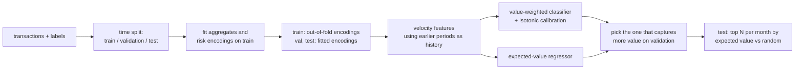

# Fraud Detection System

[](https://github.com/dsugurtuna/fraud-detection-system/actions/workflows/ci.yml)

Rank card transactions for fraud review by expected value lost, not just by probability, with CatBoost, isotonic calibration and a fixed monthly review capacity.

## The problem

A fraud team can only review so many transactions a month. A model tuned for ROC AUC treats a £5 fraud and a £5,000 fraud the same, so the review queue can fill with cheap cases while expensive ones go unreviewed. The useful question is: given N reviews a month, how much fraud value do we catch compared with reviewing at random?

## What this does

- **Features without look-ahead.** Time-of-day and weekday features, account, merchant and MCC aggregates, smoothed fraud-rate ("risk") encodings and time-since-last-transaction features, all fitted on the training period only. Risk encodings for the training rows are computed out of fold.
- **Two ways to score.** A CatBoost classifier trained with value-weighted sample weights, calibrated with isotonic regression and multiplied by the amount; and a CatBoost regressor that predicts `isFraud x amount` directly.
- **Model choice on validation.** Keeps whichever captures more fraud value on the validation period at the chosen review capacity.
- **Business-aligned evaluation.** Each month, review the top N transactions by expected value; report the fraud value captured, the expected value a random review would catch, and the ratio between them. ROC AUC and PR AUC are reported too.
- **Label delay.** If fraud reports carry a `reportedTime`, the training and validation periods only see frauds reported before the next period starts.

## Quickstart

No data is included. The demo generates synthetic transactions (seeded, with a planted fraud signal) and runs the whole pipeline.

```bash
git clone https://github.com/dsugurtuna/fraud-detection-system.git
cd fraud-detection-system
python3.11 -m venv .venv && source .venv/bin/activate
pip install -e ".[dev]"
pytest
python -m fraud_detection demo
```

Illustrative output on synthetic data (seed 0, 50 reviews a month; CatBoost results can differ slightly between platforms). The synthetic data has a deliberately strong signal, so these numbers say nothing about performance on real transactions.

```text
{"rows": {"train": 18972, "validation": 5558, "test": 5470}, "frauds": {"train": 189, "validation": 56, "test": 57}}
selected model:            classifier
test ROC AUC (classifier): 0.822
test PR AUC (classifier):  0.060
months in test:            2
reviews per month:         50
fraud value captured:      2,259.55
random-review baseline:    92.85
uplift vs random:          24.34x
```

On your own data (a transactions CSV with the columns below, plus a labels CSV of `eventId` and optional `reportedTime` for reported frauds):

```bash
python -m fraud_detection run --transactions transactions.csv --labels labels.csv \
  --val-start 2017-09-01 --test-start 2017-11-01 --capacity 400
```

Transaction columns: `transactionTime, eventId, accountNumber, merchantId, mcc, merchantCountry, merchantZip, posEntryMode, transactionAmount, availableCash`.

## How it works



| Module | Role |
| :--- | :--- |
| `features.py` | Base, aggregate, risk-encoding and velocity features |
| `model.py` | Classifier, calibration, regressor, selection |
| `evaluation.py` | Monthly top-N capture, random baseline, EV curve |
| `pipeline.py` | The whole run as one tested function |
| `synthetic.py` | Seeded synthetic transactions |

## Design decisions

- **Rank by expected value.** `P(fraud) x amount` is the quantity the review team is trying to maximise. Probability alone would rank a likely £5 fraud above a less likely £5,000 one.
- **Weight fraud by log amount, then calibrate.** The weights push the model to care about large frauds, but they distort its probabilities; isotonic regression on the validation period maps scores back to observed fraud rates, which the expected-value calculation needs.
- **Keep a direct regressor as a challenger.** Predicting value directly can win when amount and fraud interact in ways the product misses. Validation decides; the code does not assume.
- **Time-based splits.** Random splits would let the model learn from the future. Aggregates, encodings and medians are fitted on the training period only, and velocity features look back only at earlier transactions.
- **Out-of-fold risk encodings for training rows.** A merchant's smoothed fraud rate computed on the same rows it will describe includes each row's own label. That leaks the target and makes the model over-trust the feature. Out of fold, it does not.
- **Compare with random review at the same capacity.** Uplift over random is a fair baseline for "does this model help the team?", and it depends on the capacity, so the capacity is an explicit input.

## Limitations and what it is not

- It is a modelling and evaluation pipeline, not a scoring service. There is no API, monitoring or drift detection.
- Validation is used for early stopping, calibration and model selection, so validation numbers are optimistic; only the test period is a fair estimate.
- Uplift and captured value depend on the review capacity and on how many months are in the test period.
- The random baseline is an expectation, not a simulated review.
- High-cardinality IDs (`accountNumber`, `merchantId`) go into CatBoost as categorical features; new accounts at scoring time get no benefit from them.
- `legacy/Fraud_detection.py` is the original single script, kept for reference. It needs `pip install -e ".[legacy]"` and data files that are not in this repository, and it installs missing packages at run time.

## Where this fits

One of my earlier applied-ML projects, alongside [retail-demand-forecasting-at-scale](https://github.com/dsugurtuna/retail-demand-forecasting-at-scale) and [british-invoice-digitization](https://github.com/dsugurtuna/british-invoice-digitization).

## Roadmap

- Report precision and recall of the review queue alongside value captured.
- Add a cost for each review, so capacity can be chosen rather than fixed.
- Monitor score and feature drift month by month on the test period.

## Licence

MIT is declared in `pyproject.toml`, but no licence file is included yet.

---

Personal project by [Ugur Tuna](https://github.com/dsugurtuna). Not affiliated with or endorsed by any employer.
